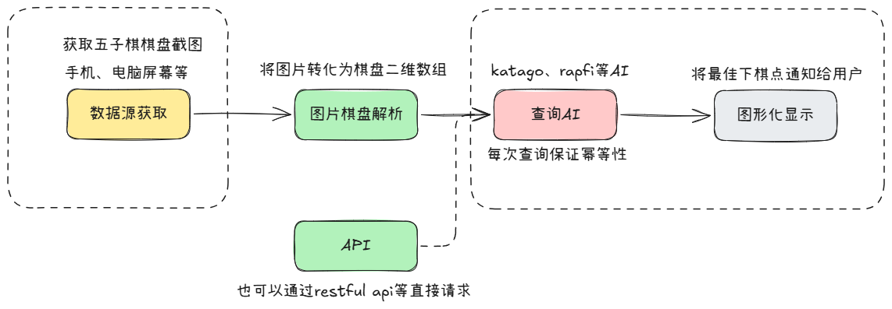
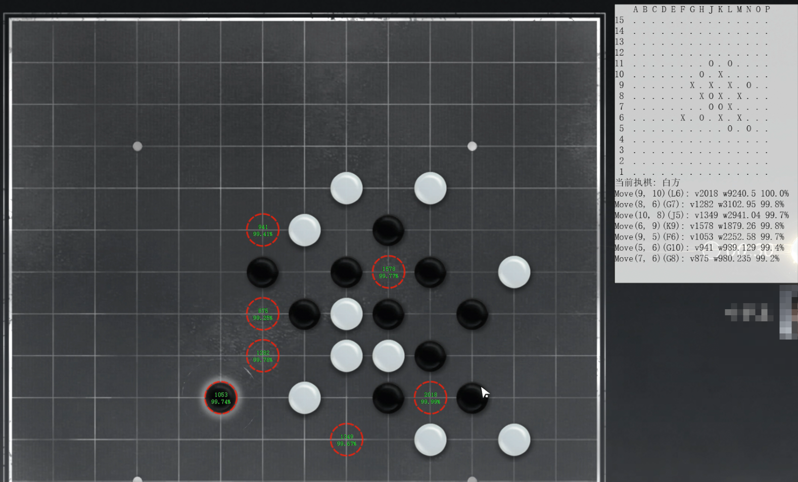

# GomokuHelper

GomokuHelper 是一款面向 “泛可视化五子棋场景” 的 AI 辅助工具，核心目标是打破游戏客户端限制，为各类可视化五子棋玩法提供 AI 决策支持。现阶段已完成与 KataGo 引擎的对接整合，将其作为 AI 决策核心，通过算法计算输出精准落子方案，助力用户在不同五子棋场景中高效决策。

GomokuHelper is an AI-assisted tool tailored for "pan-visual Gomoku scenarios". Its core goal is to break the limitations of specific game clients and provide AI decision-making support for various visual Gomoku gameplays. At this stage, it has completed the integration with the KataGo engine, which serves as the core of its AI decision-making system. Through algorithmic calculations, it generates accurate move suggestions, helping users make efficient decisions across different Gomoku scenarios.

# 项目介绍

## 支持的数据源类型-DataSource
| 序号 | 名称          | 状态       |
|------|-------------|------------|
| 1    | windows全屏截图 | ✅  |

## 支持的五子棋AI-Algorithm

| 序号 | 名称     | 状态       |
|------|--------|------------|
| 1    | Katago | ✅  |

## 支持的图形化显示-UseReport

| 序号 | 名称     | 状态       |
|------|--------|------------|
| 1    | PyQt5 | ✅  |

## 五子棋游戏适配

| 序号 | 名称           | 状态       |
|------|--------------|------------|
| 1    | 2K分辨率下的燕云十六声 | ✅  |

# 快速开始
1. 环境 Windows10，Python 3.11.3, 一块显卡

2. 下载引擎以及权重文件：https://github.com/hzyhhzy/KataGomo/releases/tag/Gomoku_20250206

3. 调节棋盘识别相关参数。可以自己测试识别效果：src/test/test_img_cut.py, src/test/test_img_recognizer.py
4. 修改相关参数，运行调度器，可参考src/yysls/yysls.py

##  参数介绍
## 参数说明
| 参数名                 | 数据类型 | 默认值       | 核心描述                                       | 约束/补充说明                                                                   |
|---------------------|----------|--------------|--------------------------------------------|---------------------------------------------------------------------------|
| `grid_size`         | `int`    | 15           | 棋盘维度定义，决定棋盘为 `grid_size × grid_size` 的方格矩阵 | 默认值15对应标准五子棋棋盘规格，非特殊场景不建议修改                                               |
| `cell_size`         | `int`    | 无默认值     | 棋盘单个方格的边长，单位为像素（px）                        | 需与 `image_size` 协同配置，确保棋盘整体显示比例协调                                         |
| `piece_size`        | `int`    | 无默认值     | 棋子直径规格，单位为像素（px）                           | 直接影响棋子与方格的适配性，建议小于 `cell_size` 以避免棋子超出方格边界                                |
| `image_size`        | `int`    | 无默认值     | 棋盘图像的整体边长，单位为像素（px）                        | 约束条件：需满足 `image_size ≈ cell_size × grid_size + piece_size`，确保棋盘完整显示       |
| `left`              | `int`    | 无默认值     | 棋盘左上角顶点距屏幕左侧边缘的像素距离                        | 用于定位棋盘在屏幕中的水平位置，需根据实际显示设备分辨率调整                                            |
| `top`               | `int`    | 无默认值     | 棋盘左上角顶点距屏幕顶部边缘的像素距离                        | 用于定位棋盘在屏幕中的垂直位置，需与 `left` 配合确保操作区域便捷性                                     |
| `katago_path`       | `str`    | 无默认值     | KataGo 引擎可执行文件（如 `.exe`）的绝对路径              | 路径格式需符合操作系统规范（Windows用`\`，Linux/macOS用`/`），路径错误会导致引擎启动失败                  |
| `model_path`        | `str`    | 无默认值     | KataGo 模型权重文件（如 `.bin.gz`）的绝对路径            | 需与引擎版本匹配，不兼容的模型文件会导致推理异常                                                  |
| `config_path`       | `str`    | 无默认值     | KataGo 引擎配置文件（如 `gtp_engine.cfg`）的路径       | 引擎运行参数（如搜索策略、超时设置）的配置文件                                                   |
| `rule`              | `str`    | 无默认值     | 五子棋落子规则定义                                  | 支持两种规则： - `RENJU`（黑子有禁手，禁止六连、三三、四四等违规落子） - `FREESTYLE`（无禁手，无特殊落子限制） |
| `visits_threshold`  | `int`    | 2000        | KataGo 引擎对单个落子位置的最大搜索次数（置信度阈值）             | 阈值越高，落子决策精度越高，但计算耗时增加；低于阈值时引擎自动停止搜索以节省性能                                  |
| `black_threshold`   | `float`  | 无默认值     | 黑棋识别的颜色归一化阈值                               | 阈值越小，要求棋子区域颜色越接近纯黑（RGB趋近0,0,0）才能判定为黑棋，抗干扰性更强                              |
| `white_threshold`   | `float`  | 无默认值     | 白棋识别的颜色归一化阈值                               | 阈值越大，要求棋子区域颜色越接近纯白（RGB趋近255,255,255）才能判定为白棋                               |
| `chess_manual_size` | `float`  | 无默认值     | 棋谱存储的最大记录数量，当达到容量上限时，采用 LRU（最近最少使用）算法淘汰旧棋谱	                               | 棋谱默认保存达到visits_threshold的输出结果	                                            |
| `chess_manual_path` | `float`  | 无默认值     | 棋谱路径                                       | 路径格式需符合操作系统规范（Windows 用\，Linux/macOS 用/）；路径不存在时将自动创建文件                    |

更多模型参数参考src/engine/algorithm/katago/gtp_engine.cfg

# 效果预览
